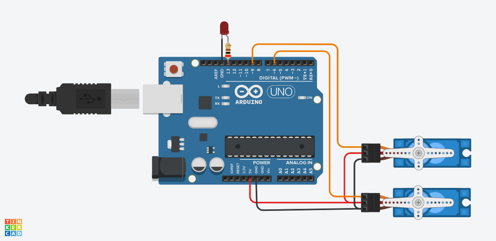
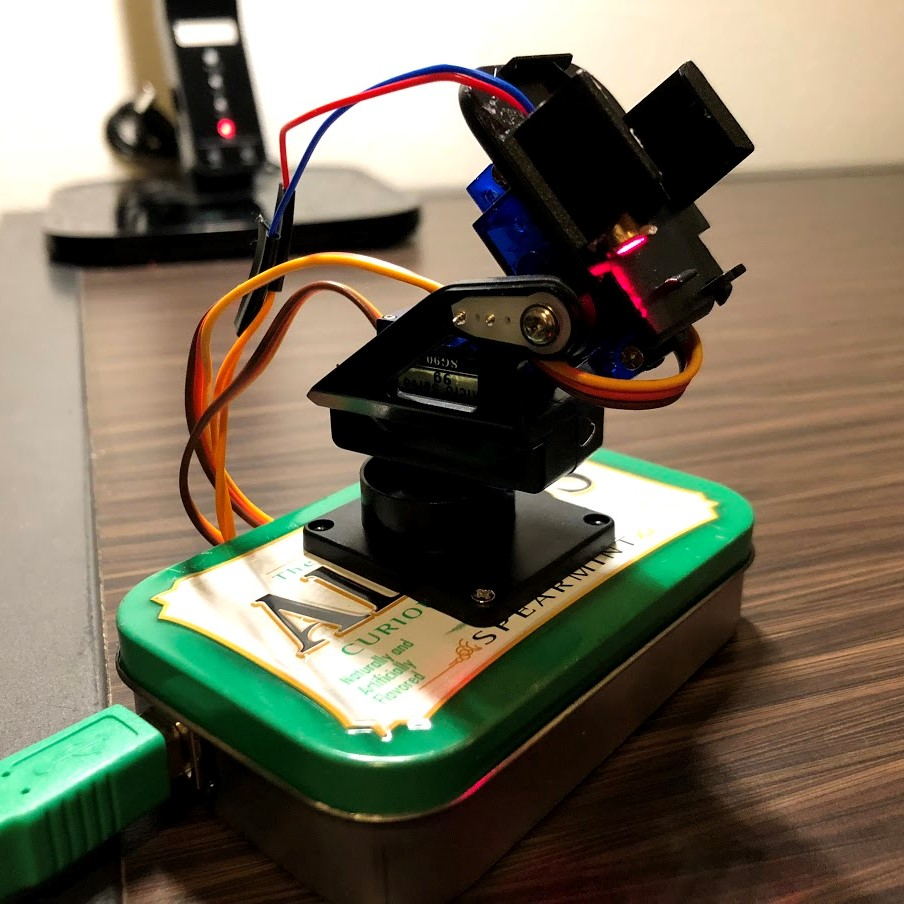
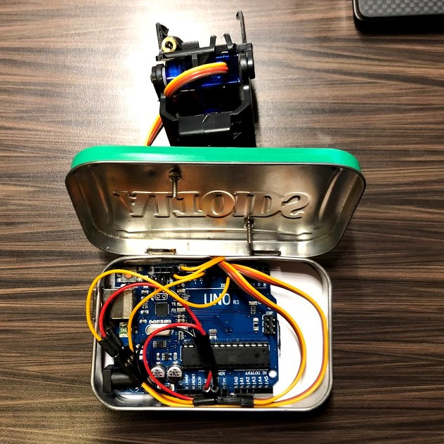

# NinjaCat-LaserTower
Ninja Cat is a robot laser toy that randomly moves a servo tower on the X and Y
axis and lights up an attached laser to train your cat to be a ninja.
This project is powered by an Arduino Uno.
## The Build
Follow these instructions to get your cat training in no time!
1. Assemble the pan/tilt servo module:

  - [Pan/Tilt Assembly](https://learn.adafruit.com/mini-pan-tilt-kit-assembly/getting-started) - by Adafruit


2. The Altoids tin:
  - Cut out a port to fit the Arduino's USB connector
  - Cut out a slot for servo and laser wires
  - Mount the pan/tilt module to the lid of the tin


3. Wiring:

  - Connect the laser to ground and pin 13
  - 5v to x-servo and y-servo in series
  - Ground (GND) to x-servo and y-servo in series
  - x-servo to pin 6
  - y-servo to pin 9



4. The program:
  - Open laserTower.ino in the Arduino IDE or [use the online editor](https://create.arduino.cc/editor)
  - Upload the program to the board
  - Modify these values based on the size of your ninja training grounds and fitness level of your cat
  ```c
  #define MIN_X 10        // X-servo angle range [MIN_X, MAX_X]
  #define MAX_X 90      
  #define MIN_Y 0         // Y-servo angle range [MIN_Y, MAX_Y]
  #define MAX_Y 40
  #define MIN_MOVE 10      // smallest move distance allowed
  #define MIN_FREEZE 100   // delay between moves range [MIN_FREEZE, MAX_FREEZE]
  #define MAX_FREEZE 1500
  #define MIN_MOVE_TIME 20 // time it takes servos to move to next position range [MIN_MOVE_TIME, MAX_MOVE_TIME]
  #define MAX_MOVE_TIME 50
  ```
  - Save and re-upload! Once you're satisfied, you can disconnect the board from your computer and power the laser tower from any outlet.


### Happy Ninja-Cat Training!


